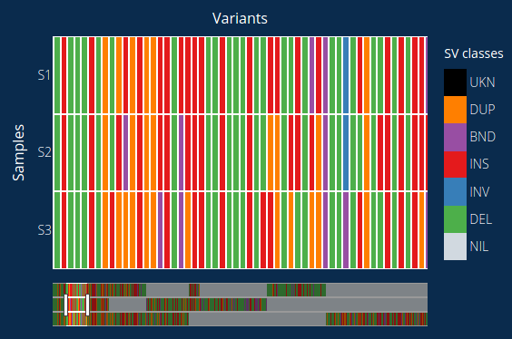

## VariantMap - Interactive heatmap for multi-sample structural variant analysis
[](https://travis-ci.com/cytham/variantmap)
[](https://pypi.org/project/variantmap/)
[](https://pypi.org/project/variantmap/)
[](https://anaconda.org/bioconda/variantmap)
[](../../releases)
[](./LICENSE.txt)

<p align="center">
    
</p>

VariantMap is a genomic structural variant (SV) visualization technique that displays variants across multiple samples in
 an interactive heatmap. It is a browser-based app implemented through [Dash](https://plotly.com/dash/) by Plotly. Each row of
  the heatmap represents an input sample and each column represents an SV breakend found in the sample cohort. The colors
   indicate the class of an SV present in a sample. More details of each variant can be displayed by simply hovering over them
   . The heatmap can be customized to suit your analysis by changing various components in the "Customize" tab.

VariantMap requires a dataframe object (HDF5 file) that can be generated by [VariantBreak](https://github.com/cytham/variantbreak
) which in turn requires VCF files generated by [NanoVar](https://github.com/cytham/nanovar) which calls SVs using third
-generation long-read sequencing data. Future upgrades will enable VariantBreak to use VCF files produced by other tools.
 
 
### Basic capabilities
* Visualize the prevalence of variants and their classes across sample cohort
* User-friendly interface to analyze and customize your data without the use of programming language
* Obtain the variant size, score, read coverage, and genotype by simply hovering over them
* Easy filtering of variants by gene name, gene type, gene feature, repetitive elements, or other annotations, depending on input
 annotation files
* Capture snapshots of heatmap by just one click
* Convenient uploading of datasets directly from the app interface


## Getting Started

### Launch the app and upload your HDF5 (.h5) dataset

```
# This Python script is installed in your PATH, execute it from anywhere
variantmap_app.py 
```

### Operating system: 
* Linux (x86_64 architecture, tested in Ubuntu 16.04)

### Installation:
There are three ways to install VariantMap:
#### Option 1: Conda
```
# Installing from bioconda
conda install -c bioconda variantmap
```
#### Option 2: Pip
```
# Installing from PyPI
pip install variantmap
```
#### Option 3: GitHub
```
# Installing from GitHub
git clone https://github.com/cytham/variantmap.git 
cd variantmap
pip install .
```

### Installation of dependencies
These should be automatically installed, or else, you have to install them manually:
* pandas >=1.1.4
* dash >=1.17.0
* tables >=3.6.1

##### 1. _pandas_
```
pip install pandas
```
or
Please visit [here](https://pandas.pydata.org/pandas-docs/stable/getting_started/install.html) for instructions to install.

##### 2. _dash_
```
pip install dash
```
or 
Please visit [here](https://dash.plotly.com/installation) for instructions to install.

##### 3. _tables_
```
pip install tables
```
or
```
conda install -c conda-forge pytables
```

## Documentation
See [wiki](https://github.com/cytham/variantmap/wiki) for more information.

## Versioning
See [CHANGELOG](./CHANGELOG.txt)

## Citation
Not available

## Author

* **Tham Cheng Yong** - [cytham](https://github.com/cytham)

## License

VariantMap is licensed under GNU General Public License - see [LICENSE.txt](./LICENSE.txt) for details.

## Limitations
* VariantMap is only compatible with HDF5 datasets produced by VariantBreak
 
* VariantMap may not be able to handle large HDF5 files (>32M) in Google Chrome. Do try with Mozilla Firefox for these larger
 files.
